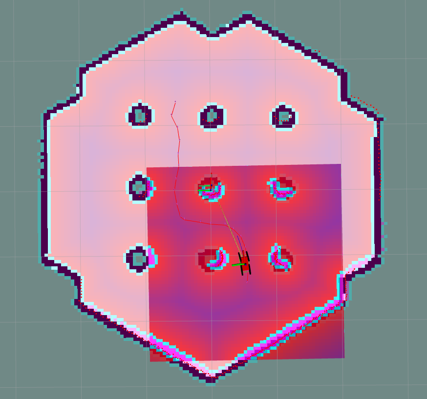

# BOLIDNAV2 PROJECT



## Table of Contents

- [Main goal](#main-goal)
- [Installation guide](#installation-guide)
- [Setup](#setup)
- [Run](#run)
- [Documentation](#documentation)
- [Contributors](#contributors)
- [Bugs & features](#bugs--feature-requests)

## Main goal


## Installation Guide

### Linux Ubuntu

1. Install [Docker](https://docs.docker.com/engine/install/ubuntu/)

2. Install [Remote Development](https://marketplace.visualstudio.com/items?itemName=ms-vscode-remote.vscode-remote-extensionpack) extenstion in VS Code. Do not check *Execute In WSL* in DEV Container: settings

3. Check if docker group exists, if not: 

    3.1 Create the docker group
        `sudo groupadd docker`

    3.2 Add user to the docker group
        `sudo usermod -aG docker $USER`

    3.3 Log out and log back in so that your group membership is re-evaluated.

4. Use View->Command Palette... or Ctrl+Shift+P to open the command palette. Search for the command Dev Containers: Reopen in Container and execute it. This will build docker container for your. It will take a while - sit back or go for a coffee.

## SETUP

1. After docker setup, run bash script from folder utils:
    `bash src/utils/env_setup.sh`
    
    It will install required dependencies and setup .bashrc, then if you open new terminal you have not to source to ROS2
    1.1 If you work in the same terminal, source ros2
        `source /opt/ros/humble/setup.bash`

2. Build tha ROS2 package in /home/ws with command:
    `colcon build --symlink-install`

ERRORS:
    If you have problem with display windows, use:
    `export DISPLAY=:0`

## RUN

1. After SETUP, set key environment variables:

```bash
source install/setup.bash
    
export TURTLEBOT3_MODEL=waffle

export GAZEBO_MODEL_PATH=$GAZEBO_MODEL_PATH:/opt/ros/humble/share/turtlebot3_gazebo/models
```

2. In the same terminal, run:

    ### Default config (try this first):

    ```bash
    ros2 launch nav2_bringup tb3_simulation_launch.py headless:=False
    ```

    ### Our config:

    Default launch file have to be changed, because it's poorly done at doesn't allow parametrisation. It is located in: `/opt/ros/humble/share/nav2_bringup/launch/tb3_simulation_launch.py`
    Fixed file is provided in: `/home/ws/src/utils/tb3_simulation_launch.py`

    You can copy it with:
    ```bash
    sudo cp /home/ws/src/utils/tb3_simulation_launch.py /opt/ros/humble/share/nav2_bringup/launch/tb3_simulation_launch.py
    ```
    
    Launch PRM* using:
    ```bash
    ros2 launch nav2_bringup tb3_simulation_launch.py headless:=False params_file:=/home/ws/src/prm_star/config/nav2_params.yaml robot_sdf:=/home/ws/src/ackermann_v2/src/description/ackermann_vehicle.urdf rviz_config_file:=/home/ws/src/ackermann_v2/rviz/rviz_config.rviz
    ```

    Launch HybridPlanner + MPPI using:
    ```bash
    ros2 launch nav2_bringup tb3_simulation_launch.py headless:=True params_file:=/home/ws/src/prm_star/config/nav2_params2.yaml robot_sdf:=/home/ws/src/ackermann_v2/src/description/ackermann_vehicle.urdf rviz_config_file:=/home/ws/src/ackermann_v2/rviz/rviz_config.rviz
    ```

    Launch HybridPlanner + RPP:
    ```bash
    ros2 launch nav2_bringup tb3_simulation_launch.py headless:=True params_file:=/home/ws/src/prm_star/config/nav2_rpp.yaml robot_sdf:=/home/ws/src/ackermann_v2/src/description/ackermann_vehicle.urdf rviz_config_file:=/home/ws/src/ackermann_v2/rviz/rviz_config.rviz
    ```

    If you want to launch any of above configurations on our map add:
    ```bash
    world:=/home/ws/src/prm_star/worlds/mapa2.sdf map:=/home/ws/src/prm_star/worlds/mapa2.yaml
    ```
    at the end of any launch command.


## Documentation

### 1. Ackerman + PRM + Dubins

__PRM (Probabilistic Roadmap Method)__
- Generate random points in the configuration space.
- Connect these points with edges representing possible vehicle movements, decreasing the connection radius as more points are added.
- Find the shortest path between the start and end points using the previously constructed roadmap.

__Dubins Curves__

- Consider vehicle orientation and wheel turn angle.
- Can be a combination of three segments: left turns (L), right turns (R), and straight segments (S). Typical combinations include LSL, RSR, LSR, RSL, LRL, and RLR.
- For each of the six combinations, calculate the length of individual segments (S, L, R).
- Choose the combination with the shortest total length.

### 2. Analysis of Pure Pursuit Controller

__Short Lookahead Distance:__

- Provides more precise trajectory tracking but may cause excessive corrections.
- Can lead to instability and vehicle oscillation.
- Suitable for sharp turns (precise and quick direction changes).
- Best for low speeds (the vehicle has more time for reaction and adjustments).

__Long Lookahead Distance:__
- Increases driving stability as the vehicle responds more gently to trajectory changes.
- May result in inaccurate tracking of sharp turns.
- Suitable for gentle turns and straight segments.
- Ideal for high speeds (to avoid sudden maneuvers that can be dangerous at high speeds).

__Methods for Choosing Lookahead Distance:__

- Curve radius – greater curvature (smaller turn radius) = shorter lookahead distance.
- Vehicle speed – linear dependency, lookahead distance increases with speed.


### 3. Hybrid Astar Planner

- An extension of the classic A* algorithm adapted to consider the dynamic and kinematic constraints of vehicles.
- Instead of simple grid movements, the vehicle can perform maneuvers considering the turning radius.
- Each state node includes not only position (x, y) but also vehicle orientation (θ).

### 4. Analysis of MPPI Controller (MPC Advanced)

__MPC (Model Predictive Control)__

- Solves an optimization problem at each time step to obtain a sequence of control inputs.
- Predicts future behavior and finds control inputs that minimize the cost function.

__MPPI (Model Predictive Path Integral Control)__

- A variant of MPC that uses stochastic optimization.
- Considers two main features:

> Trajectory: Samples multiple trajectories to explore various future system behaviors (state space exploration). Evaluates the cost of each trajectory.

> Horizon: Number of time steps over which future trajectories are considered in the optimization problem. Determines how far ahead the controller looks. Too short → low predictive ability → poor decisions. Too long → high computational complexity.

### 5. Comparision of controllers:

## DWB Controller
- Only for Differential and Omnidirectional robot types.
- Dynamic obstacle avoidance.
## MPPI Controller
- Additionally supports Ackermann and Legged robots.
## RPP (Reference Path Planner)
- Supports Differential, Ackermann, and Legged robots.
- Exact path following.


## Config files:

ackermann_v2/config/nav2_params2.yaml - nav2 parameters

ackermann_v2/src/decription/ackermann_vehicle.urdf - our vehicle model

ackermann_v2/rviz/urdf_config.rviz - Rviz config file

## Contributors

__JJayU__ - [Github](https://github.com/JJayU) (Jakub Junkiert, 147550)

__the_HaUBe__ - [Github](https://github.com/theHaUBe) (Hubert Górecki 147599)

__Yerbiff__ - [Github](https://github.com/Yerbiff) (Jarosław Kuźma 147917)

__2acholsk1__ - [Github](https://github.com/2acholsk1) (Piotr Zacholski 147597)

## Bugs & Feature Requests

Please report bugs and request features using the [Issue Tracker](https://github.com/2acholsk1/prm_star_mr/issues).