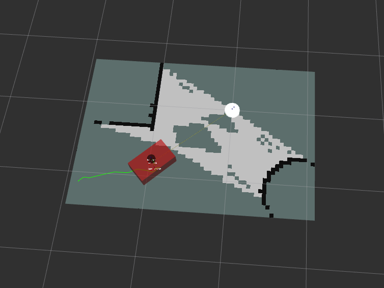
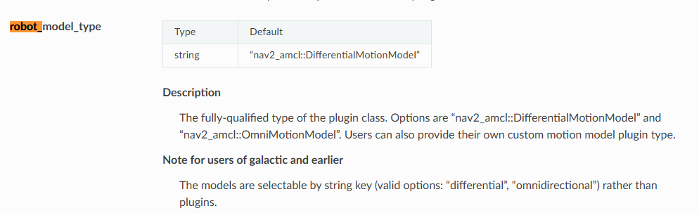

# PRM* PROJECT

## Installation Guide

### Linux Ubuntu

1. Install [Docker](https://docs.docker.com/engine/install/ubuntu/)

2. Install [Remote Development](https://marketplace.visualstudio.com/items?itemName=ms-vscode-remote.vscode-remote-extensionpack) extenstion in VS Code. Do not check *Execute In WSL* in DEV Container: settings

3. Check if docker group exists, if not: 

    3.1 Create the docker group
        `sudo groupadd docker`

    3.2 Add user to the docker group
        `sudo usermod -aG docker $USER`

    3.3 Log out and log back in so that your group membership is re-evaluated.

4. Use View->Command Palette... or Ctrl+Shift+P to open the command palette. Search for the command Dev Containers: Reopen in Container and execute it. This will build docker container for your. It will take a while - sit back or go for a coffee.

## SETUP

1. After docker setup, run bash script from folder utils:
    `bash /utils/env_setup.sh`
    
    It will install required dependencies and setup .bashrc, then if you open new terminal you have not to source to ROS2
    1.1 If you work in the same terminal, source ros2
        `source /opt/ros/humble/setup.bash`

2. Build tha ROS2 package in /home/ws with command:
    `colcon build --symlink-install`

ERRORS:
    If you have problem with display windows, use:
    `EXPORT DISPLAY=:0`

## EXAMPLE OF NAV2

1. After SETUP, set key environment variables:

    `source install/setup.bash`
    
    `export TURTLEBOT3_MODEL=waffle`

    `export GAZEBO_MODEL_PATH=$GAZEBO_MODEL_PATH:/opt/ros/humble/share/turtlebot3_gazebo/models`

2. In the same terminal, run:

    Default config:

    `ros2 launch nav2_bringup tb3_simulation_launch.py headless:=False`

    Our config:
    
    `ros2 launch nav2_bringup tb3_simulation_launch.py headless:=False params_file:=prm_star/config/nav2_params.yaml`


## Our vehicle with our world and our planner



You might have to install following packages, but try without them and tell me if any is unnecessary. (or remove these lines)

```bash
sudo apt install ros-humble-joint-state-publisher-gui
sudo apt install ros-humble-xacro
sudo apt install ros-humble-robot-localization #może niepotrzebne ale kto wie
```

Start by colcon build and source as always.

In first terminal run:

```bash
ros2 launch ackermann_v2 display.launch.py
```

This will start Rviz and Gazebo. Our vehicle will spawn and map should show up.

After this, you can launch:
```bash
ros2 launch nav2_bringup navigation_launch.py params_file:=/home/ws/src/ackermann_v2/config/nav2_params2.yaml
```

This will start nav2 with our params file.

### Current state:

- we have working car model with Ackermann kinematics,

- it can be moved with nav2,

- currently it's working with "nav2_navfn_planner/NavfnPlanner", I tried changing it to our planner which is currently straightline planner but it didn't move, don't know why xD

- we need to implement proper robot_model_type as planner currently thinks it has a turtlebot kinematics:

I think that what we need to do

- behaviour server and local planer probably need to be changed also,

- when Fixed Frame in Rviz is set to map, wheels are not attached to body, tf missing

- no global map yet,

- can't navigate to places outside map (yet)

### Config files:

ackermann_v2/config/nav2_params2.yaml - nav2 parameters

ackermann_v2/config/ekf.yaml - state observer used to predict current location (not sure)

ackermann_v2/src/decription/ackermann_vehicle.urdf - our vehicle model

ackermann_v2/rviz/urdf_config.rviz - Rviz config file

ackermann_v2/launch/display.launch.py - main launch script 
